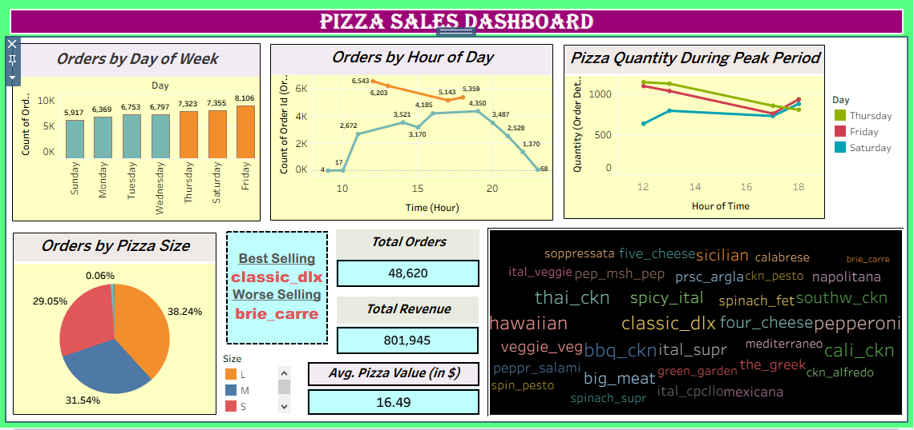

# Pizza_Sales_Dashboard
Interactive Tableau dashboard analyzing pizza sales by day, time, category, and pizza type.

## Project Overview
This project analyzes pizza sales data using Tableau to uncover insights such as:
- Ordering patterns by **day of week** and **hour of day**
- Popular **pizza sizes** and categories
- Best-selling and worst-selling pizzas
- Peak order periods across weekdays
- Key performance indicators (Total Orders, Revenue, Average Order Value)

The dashboard helps to quickly understand **sales performance**.

## Dashboard Preview

## Key Insights
- **Friday** has the highest number of orders (~8K).  
- Orders peak between **12 PM – 7 PM**.  
- **Large size pizzas** are the most ordered (38%).  
- Best-selling pizza: `classic_dlx`  
- Least-selling pizza: `brie_carre` 

## Repository Contents
- `Pizza+Place+Sales.zip` → Dataset used
- `Pizza_sales_Dashboard.twb` → Tableau packaged workbook
- `pizza_dashboard.png` → Screenshot of dashboard  
- `README.md` → Project documentation  

## Tools Used
- **Tableau**  
- **Excel/CSV**

## Author
Created by *Ketaki Gade* as part of Tableau learning and practice projects.
